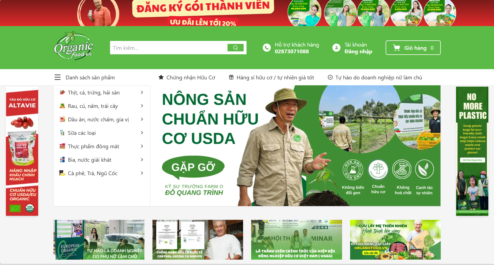
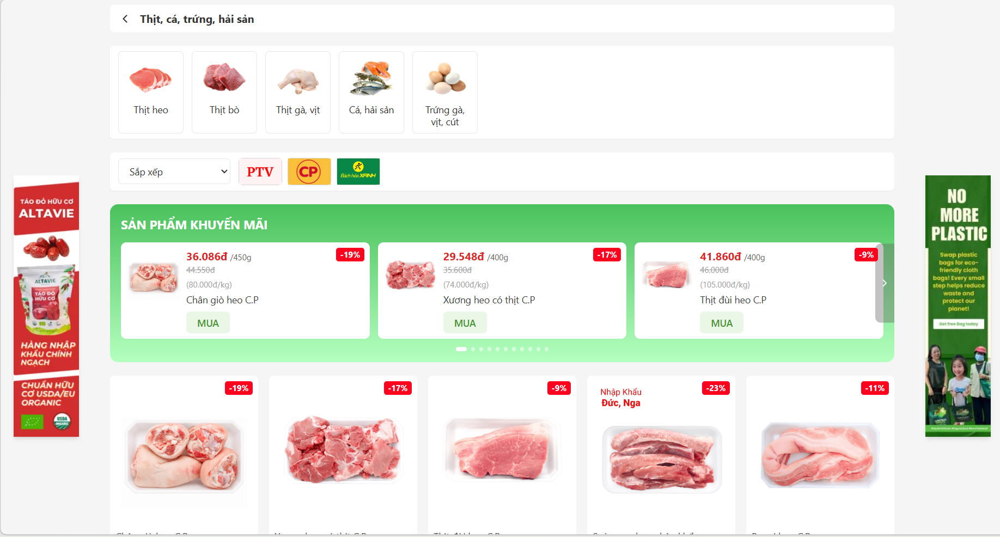

<div align="center">

# 🥬 OrganicFood — Organic Food E-commerce Platform

An **e-commerce platform for organic, fresh food**, built with a decoupled Frontend–Backend architecture, supporting the full business flow from browsing products and promotions to cart management, checkout, and user authentication.

> ⚠️ **Note:** the backend runs on Render's **free tier**, which spins down after 15 minutes of inactivity — the **first request** may take **30–60 seconds** to respond while the server wakes up. This is expected, not a bug. Please be patient on the first load.

[](https://organic-food-mauve.vercel.app/)
[](https://openjdk.org/)
[](https://spring.io/projects/spring-boot)
[](https://react.dev/)

**[🔗 View Live Demo](https://organic-food-mauve.vercel.app/)**

</div>

---

## 📸 Demo Screenshots

<!--
  Replace the image paths below with your actual screenshots.
  Capture the main pages (Home, Product List, Product Detail, Cart,
  Login/Register...), save them under /docs/screenshots in the repo,
  and update the paths accordingly.
-->

<div align="center">

| Home Page | Product List |
|:---:|:---:|
|  |  |

</div>

> 💡 **Tip for a "sliding" demo effect:** plain GitHub Markdown doesn't support a real carousel, but you can get a similar effect with a **screen-recorded GIF** walking through the app (tools like [ScreenToGif](https://www.screentogif.com/) or [LICEcap](https://www.cockos.com/licecap/)) — it auto-plays on page load and reads far better to a recruiter than a row of static images.

---

## 📖 About The Project

**OrganicFood** is a full-stack e-commerce web application simulating an online organic food store, built to practice and showcase industry-standard full-stack development: a clean layered architecture, JWT/OAuth2-based security, performance optimization via caching, and a complete cloud deployment pipeline.

The project covers the core business flows of a food retail platform:
- Managing categories, brands, products, and promotions (percentage-based, time-limited discounts)
- Secure user authentication and account management (OTP-verified registration, login, token refresh)
- A smooth shopping experience: search, filter, view product details, cart, and checkout
- Automated transactional emails (account verification, order notifications, etc.)

---

## 🌐 Live Demo

| | |
|---|---|
| 🔗 **Frontend URL** | [https://organic-food-mauve.vercel.app/](https://organic-food-mauve.vercel.app/) |
| 📘 **API Docs (Swagger)** | `<BACKEND_URL>/organicfood/api/v1/swagger-ui.html` |

---

## 🛠️ Tech Stack

### Backend
| Component | Technology |
|---|---|
| Language / Framework | Java 21, Spring Boot |
| Security | Spring Security, JWT (RSA), OAuth2 Resource Server |
| Database | PostgreSQL |
| Migration management | Flyway |
| Cache / Session | Redis |
| Object mapping | MapStruct |
| API documentation | SpringDoc OpenAPI (Swagger UI) |
| Image storage | Cloudinary |
| Email delivery | Brevo API |
| Modular architecture | Spring Modulith |

### Frontend
| Component | Technology |
|---|---|
| UI library | React (TypeScript) |
| Styling | Tailwind CSS |
| Build tool | Vite |

### Infrastructure & Deployment
| Component | Technology |
|---|---|
| Containerization | Docker, Docker Compose |
| Backend hosting | Render (Web Service + PostgreSQL + Key Value/Redis) |
| Frontend hosting | Vercel |
| Source control | Git (monorepo — FE & BE combined) |

---

## ✨ Key Features

- 🔐 **Authentication & Authorization**: OTP-verified email registration, JWT-based login (access + refresh tokens), role-based endpoint security
- 🛍️ **Product Catalog**: browse by category and brand, search and filter products
- 🏷️ **Promotions**: time-limited, percentage-based discount campaigns per product
- 🛒 **Cart & Checkout**: add/update/remove cart items, place orders
- 👤 **Account Management**: view and update personal profile information
- 🖼️ **Image Management**: product image upload and optimization via Cloudinary
- 📧 **Email Notifications**: automated verification and notification emails via Brevo
- 📑 **API Documentation**: auto-generated, interactive API docs via Swagger UI

---

## 🚀 Getting Started (Local Setup)

### Prerequisites

- [Java 21](https://adoptium.net/)
- [Node.js](https://nodejs.org/) (v18+)
- [Docker & Docker Compose](https://www.docker.com/)
- Git

### 1. Clone the repository

```bash
git clone <YOUR_REPO_URL>
cd organic-food
```

### 2. Run the Backend

The backend uses Docker Compose to spin up PostgreSQL, Redis, and the Spring Boot application together.

```bash
cd organicfood-be
```

Create your local config file at `src/main/resources/application-local.yml` (if not already present), based on the provided `application-local.example.yml` template — fill in your own keys (Cloudinary, Brevo, etc.).

Start the full stack with Docker:

```bash
docker compose up -d --build
```

Once started, the backend will be available at:
```
http://localhost:8081/organicfood/api/v1
```

API documentation (Swagger UI):
```
http://localhost:8081/organicfood/api/v1/swagger-ui.html
```

> Flyway automatically creates the database schema on application startup — no manual migration step required.

### 3. Run the Frontend

In a new terminal:

```bash
cd organicfood-fe
npm install
```

Create a `.env` file at the root of `organicfood-fe`:

```
VITE_API_URL=http://localhost:8081/organicfood/api/v1
```

Start the dev server:

```bash
npm run dev
```

By default, the frontend runs at:
```
http://localhost:5173
```

### 4. Stop the stack

```bash
docker compose down
```

(Add the `-v` flag to also remove database volumes: `docker compose down -v`)

---

## 📁 Project Structure

```
organic-food/
├── organicfood-be/          # Backend - Spring Boot
│   ├── src/
│   │   └── main/
│   │       ├── java/        # Source code
│   │       └── resources/
│   │           ├── application.yml         # Shared config
│   │           ├── application-local.yml   # Local env config (not committed)
│   │           ├── application-prod.yml    # Production env config (Render)
│   │           └── db/migration/           # Flyway migration scripts
│   ├── Dockerfile
│   ├── docker-compose.yml
│   └── pom.xml
│
├── organicfood-fe/           # Frontend - ReactJS
│   ├── src/
│   │   ├── pages/
│   │   ├── hooks/
│   │   └── components/
│   ├── package.json
│   └── vite.config.ts
│
└── README.md
```

---

## ☁️ Deployment

| Component | Platform | Notes |
|---|---|---|
| Backend | [Render](https://render.com) | Web Service (Docker) + PostgreSQL + Key Value (Redis), Free tier |
| Frontend | [Vercel](https://vercel.com) | Auto-deploy from `main` branch, Root Directory: `organicfood-fe` |
| Database | Render PostgreSQL | Free tier — demo data seeded manually |
| Image storage | Cloudinary | CDN, independent of backend hosting location |

CI/CD flow: every `git push` to `main` triggers an automatic build & redeploy on both Render and Vercel — no manual steps required.

---

## 📌 Additional Notes

- This is a personal project built for **learning purposes and portfolio presentation**; product data is sample/demo data (collected for demonstration only) and does not reflect real business data.
- The demo database runs on a free-tier plan and may be reset periodically.

---

<div align="center">

Made with ☕ and Spring Boot

</div>
